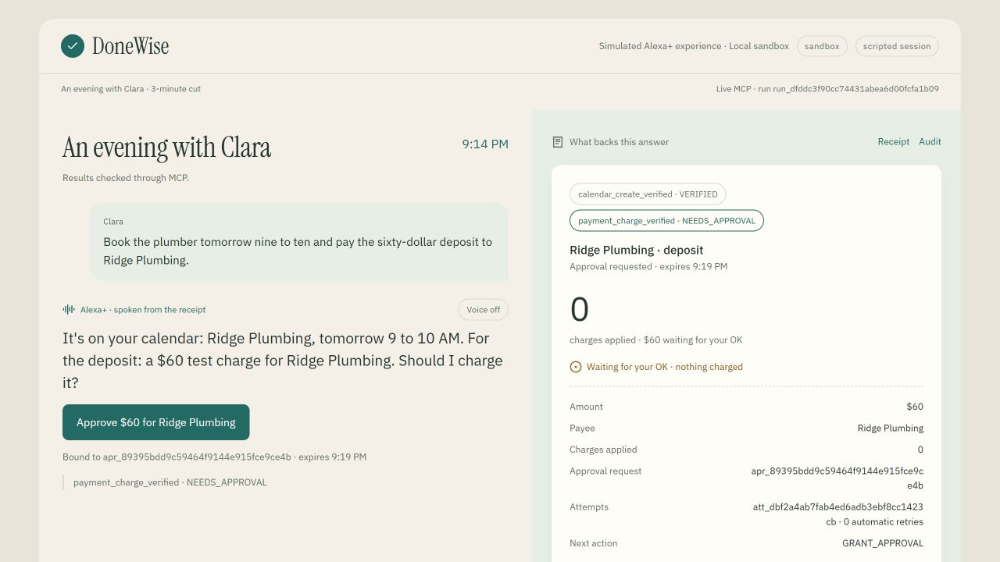
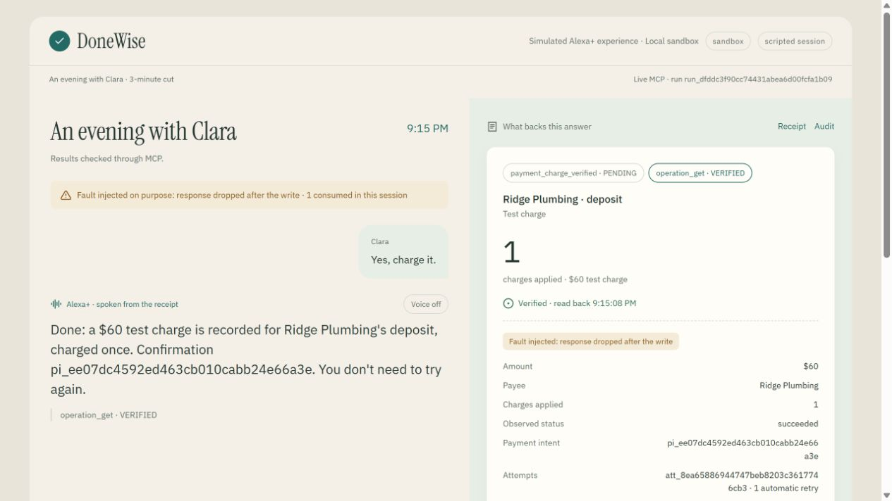
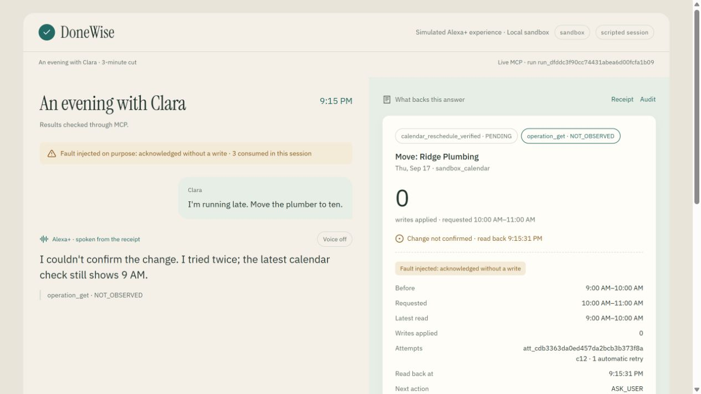

# DoneWise

An assistant that verifies external effects before claiming success. The asynchronous harness,
MCP Streamable HTTP server and web simulator run against persisted local Fake adapters.
The five-turn demo uses real MCP calls and receipt-derived speech; no real money is moved.

## Deterministic sandbox · Fake adapters · no model

Run `run_c1489defba8445f1a7592d550df68884` · matrix `2026-09-17-v2`.

| Metric | Baseline | DoneWise |
| --- | --- | --- |
| False success claims / success claims | 4/10 | 0/11 |
| Scenarios with false claims / executed | 3/10 | 0/10 |
| Extra charges / authorized payment intents | 2/4 | 0/4 |
| Extra events / authorized creation intents | 0/3 | 0/3 |
| Completed mutations / mutation scenarios | 2/7 | 6/7 |
| Completed protections / protection scenarios | 1/3 | 3/3 |
| Verified mutations / mutation scenarios | 0/7 | 6/7 |
| Unauthorized writes | 1 | 0 |
| External turns | 16 | 16 |
| Tool calls (excluding setup) | 16 | 16 |
| Adapter write attempts | 14 | 15 |
| Timeouts | 0 | 0 |

Timing is diagnostic only: logical clock; read window not simulated. Real verification latency requires RF-13 with real adapters.
Harness-only protection rows are not an identical-provider-fault comparison.
**Zero in a finite sample does not mean never.** This compares the whole harness, not just verification.

Reproduce: `uv run donewise-evals --runner deterministic --output-dir "evals/results"`

[Full evidence and S01 contrast](evals/results/2026-09-17-sandbox-run_c1489defba8445f1a7592d550df68884.json) · [Approved matrix and limits](evals/README.md).

This table is not a live LLM, Google or Stripe run. A separate Claude Code/Sonnet sandbox session is recorded below. Voice controls are implemented; human microphone/TTS rehearsal remains pending.

## What is real / what is simulated

| Component | Implemented and evidenced | Boundary |
| --- | --- | --- |
| MCP server and MIT harness | Stateful Streamable HTTP, contracts, bound consent, SQLite receipts, read-back and bounded replay | One server process per data directory; not a hosted service |
| Scripted web session | Real MCP, SSE and persisted Fake stores; only user inputs are scripted | No LLM, Google account or Stripe transaction |
| Faults | Injected lost responses and acknowledgements without writes | Controlled experiments, not provider failure rates |
| Offline preview | Same UI loading `sim/fixtures/story-3min.json` | Invented fixture; labelled disconnected; not acceptance evidence |
| Claude Code | Sonnet completed five turns in the [recorded sandbox run](docs/traces/claude-code-client.md) | Not the simulator's live LLM path or an Alexa integration |
| Google Calendar / Stripe test | [Connected provider smoke passed](docs/stripe-sandbox.md): calendar create/move/read and one $1 Stripe test payment, replayed with the same identity | Full connected fault acceptance and latency measurements pending |
| Voice / Alexa+ | Browser speech controls and a simulated Alexa+ experience | No official Alexa+ integration, account linking or certification; human audio rehearsal pending |

## Quickstart: no keys, no real money

Install Docker with Compose, then from the repository root:

```sh
docker compose up --build
```

Open [the simulator](http://localhost:8080). Leave **Scripted** selected and press **Continue**
five times, waiting for each result. The sequence books, requests consent, recovers a lost payment
response, refuses to confirm a failed move, retries on request, and recaps receipts.
The second Continue is the scripted human approval. Payments are local Fake records.

Compose reads `.env.example` directly: `DONEWISE_MODE=sandbox`, `LLM_PROVIDER=none` and a public
local-demo admin capability. That value is not a production secret. MCP is at
`http://localhost:8765/mcp`; only loopback ports are published. Do not expose this configuration
publicly. `./data` stores SQLite and Fake JSON. `docker compose down` preserves it. Simulator
sessions are in memory; restarting the simulator starts a new conversation, while receipts persist.

If host ports are occupied, use PowerShell overrides (internal ports remain 8765/8080):

```powershell
$env:DONEWISE_SERVER_PORT = '18765'
$env:DONEWISE_SIM_PORT = '18080'
docker compose up --build
```

Then open `http://localhost:18080`. These ports were used in the
[Docker acceptance](docs/traces/docker-compose.md), preserving existing servers. Compose does not
use private `.env` values as its service environment; connected instructions use `uv --env-file`.
Never put private credentials in `.env.example`.

## Screenshots from the real UI

Captured from `sim/static` served by Docker, Scripted mode, sandbox adapters, live MCP; voice off.
These are application screenshots, not the mockup or offline fixture.







Capture conditions and persisted-store checks: [Docker acceptance](docs/traces/docker-compose.md).

## Video claims → evidence

Every narration segment from [PRD §9.1](docs/prd.md) is mapped below. No final video exists yet.
Use the qualified wording; the planned connected-provider and Alexa+ claims remain unsupported.

| Segment / planned claim | Receipt, trace or test | Supported wording today |
| --- | --- | --- |
| 0:00 “This one charged twice” / “Nothing was checked” | [S01 baseline result](evals/results/2026-09-17-sandbox-run_c1489defba8445f1a7592d550df68884.md) and companion JSON | Deterministic Fake baseline recorded two charges totaling $120; not Stripe or a model-generated quote |
| 0:08 “MCP add-on for Alexa+… reads… never does it twice” | [Recovery/replay tests](tests/test_harness.py), [client trace](docs/traces/claude-code-client.md) | MCP verification harness in a simulated Alexa+ UI; zero duplicates in this finite suite, no universal guarantee |
| 0:15 “Real MCP… 2025-11-25… real calendar and test payment… two faults” | [Initialize](docs/traces/initialize.json), [simulator trace](docs/traces/simulator-flow.md), [fault tests](tests/test_fault_proxy.py) | Real MCP; Fake calendar/payment and deliberate faults. Connected claim pending |
| 0:25 “Books, reads back, asks… exact amount and payee… nothing charged” | [Five-turn trace](docs/traces/simulator-flow.md), [consent trace](docs/traces/elicitation.md), [tests](tests/test_sim.py) | Verified sandbox event and bound $60 approval with zero writes before consent |
| 0:45 “Response lost… recovered by reading… one test charge” | [Client turn 2](docs/traces/claude-code-client.md), `test_t08_payment_response_lost_recovered_charged_once` in [tests](tests/test_harness.py) | One Fake charge recovered through read-back and bounded identity-preserving replay |
| 1:15 “Calendar said OK… twice… retried once… then asked… showed ten” | [Client turns 3–4](docs/traces/claude-code-client.md), [five-turn MCP/SSE test](tests/test_sim.py) | NOT_OBSERVED after two false acknowledgements; explicit retry of the same operation verified 10–11 |
| 1:40 “Only repeats what it checked, and when” | [Client turn 5](docs/traces/claude-code-client.md), [tests](tests/test_sim.py) | Recap reports stored observations and timestamps without writes; not a fresh provider read |
| 1:55 “Any MCP client gets the same receipt” | [Inspector CLI](docs/traces/inspector-handshake.md), [Claude Code](docs/traces/claude-code-client.md), [official-client tests](tests/test_server.py) | These clients received structured receipts; Desktop and arbitrary clients unvalidated |
| 2:20 “Zero false confirmations, zero duplicates… numbers… compose” | Table above, [matrix](evals/README.md), [Docker trace](docs/traces/docker-compose.md) | Zero observed in the published deterministic sample, with denominators and whole-harness comparison limits |

## Connect an MCP client

Start Compose first. The demo has no MCP bearer token. If configured, supply
`Authorization: Bearer <your-token>` through the client, never a model prompt. Keep the MCP session
and operation ID when polling PENDING; a late response is not permission to submit another write.

**Inspector (CLI tested):**

```sh
npx --yes @modelcontextprotocol/inspector@1.0.2 --cli http://127.0.0.1:8765/mcp --transport http --method tools/list
```

For the UI, run `npx @modelcontextprotocol/inspector@1.0.2`, select Streamable HTTP and enter that
URL. The pin matches the [recorded run](docs/traces/inspector-handshake.md); newer versions remain
unvalidated here. [Official CLI reference](https://github.com/modelcontextprotocol/inspector/blob/main/clients/cli/README.md).

**Claude Desktop (example, unvalidated here):** add this to its MCP configuration and restart.
Node.js/npx and the external `mcp-remote` bridge are required.

```json
{"mcpServers":{"donewise":{"command":"npx","args":["-y","mcp-remote","http://127.0.0.1:8765/mcp"]}}}
```

This assumes no bearer token. Obtain consent through a trusted human UI; never give the model admin
or consent tokens. [Setup and limitations](docs/traces/inspector-handshake.md).

**Claude Code (five-turn sandbox run recorded):**

```sh
claude mcp add --transport http donewise http://127.0.0.1:8765/mcp
```

See [official HTTP configuration](https://code.claude.com/docs/en/mcp) and our
[client trace](docs/traces/claude-code-client.md) for tested JSON, version, `--strict-mcp-config`,
session reuse, receipt-only prompting and operator-managed approval. That run used port 8766.
Without form elicitation, a trusted operator must supply consent via the token flow; a model's
“yes” is not capability. The historical provenance issue in the trace predates the current
`mcp_client`/`session_ui` distinction in the [server guide](server/README.md).

## Run connected with your own keys (opt-in)

Use Python 3.12 and uv. Stop Compose if you need its ports. Copy `.env.example` to ignored `.env`:

```dotenv
DONEWISE_MODE=connected
GOOGLE_SERVICE_ACCOUNT_JSON=/absolute/path/to/private-service-account.json
GOOGLE_CALENDAR_ID=your-dedicated-test-calendar-id
STRIPE_SECRET_KEY=sk_test_your_own_key
DEMO_ADMIN_TOKEN=your-own-local-admin-secret
MCP_BEARER_TOKEN=your-own-local-mcp-secret
DONEWISE_DATA_DIR=./data/connected
LLM_PROVIDER=none
USER_TIMEZONE=America/Los_Angeles
```

Enable Google Calendar API and share a dedicated test calendar with the service account with event
edit permission. Do not invite attendees. Use only Stripe test-mode secrets; startup rejects other
keys. Supported prefixes are `sk_test_` and the CLI's temporary `rkcs_test_` sandbox keys;
production and publishable keys are rejected. Keep credential JSON outside the repository.
The [Stripe sandbox setup and evidence](docs/stripe-sandbox.md) covers account-free provisioning,
expiry, local configuration, and the connected smoke check recorded on 18 September 2026.
Run in two terminals from the repository root:

```sh
uv sync --frozen
uv run --env-file .env donewise-server
# Second terminal:
uv run --env-file .env donewise-sim
```

The scripted path needs no model. Explicit connected smoke test:

```sh
uv run --env-file .env pytest -m connected
```

It creates/moves/deletes a calendar event and records a $1 Stripe test payment, then repeats the
payment request with the same idempotency key and checks that it returns the same PaymentIntent.
Full connected fault
acceptance and provider-dashboard evidence remain pending. For free input, set
`LLM_PROVIDER=anthropic`, `ANTHROPIC_API_KEY` and an available `ANTHROPIC_MODEL`, or use Bedrock below;
select **Free voice** to start a new session. `USER_TIMEZONE` (`America/Los_Angeles` by default, or
`America/Santiago`) sets the clock the model, the scripted story, the recap and the page use.
Normal CI requires no provider credentials.

The model never sees `submission_id` or `approval_id`: the simulator generates the submission per
call and only the consent path adds an approval. A rejected tool call returns the violated rule
(never the value) and, when the turn produced no receipt, the model's question is shown. A small
manual eval, `scripts/eval_tool_calls.py`, measured this with Sonnet 4.6 in sandbox mode (3 runs
per scenario, 18-sep-2026): a future time books on the first call 3/3; a past time yields a
visible question with zero writes 3/3 and books only after the user answers 3/3.

## Latency: pending real adapters

| Tool | Fake p50 / p95 | Connected p50 / p95 |
| --- | --- | --- |
| calendar_create_verified | Not benchmarked | pending real adapters |
| calendar_reschedule_verified | Not benchmarked | pending real adapters |
| payment_charge_verified | Not benchmarked | pending real adapters |
| approval_grant | Not benchmarked | pending real adapters |
| operation_get | Not benchmarked | pending real adapters |
| receipts_recap | Not benchmarked | pending real adapters |

Deterministic timing uses a logical clock and omits read-window latency. It is not a benchmark.
`DONEWISE_PENDING_AFTER=0.45` is a budget, not a percentile; `FAKE_PAYMENT_DELAY_SECONDS=0.65` makes
PENDING visible. Future measurements must distinguish initial response from verified completion
and record sample size, environment and faults.

## AWS integration: pending validation

| Service | Purpose | Configuration / boundary |
| --- | --- | --- |
| Amazon Bedrock | Optional boto3 Converse model tool selection in `sim/donewise_sim/llm.py` | Set `LLM_PROVIDER=bedrock`, `AWS_REGION`, `BEDROCK_MODEL_ID` and credentials through the boto3 credential chain. Live invocation, permissions and performance pending |
| Amazon Bedrock AgentCore Runtime | Proposed managed MCP hosting | No integration/deployment configuration exists here. Future setup needs an execution role, region, ARM64 image, MCP runtime configuration, authentication and durable state design; deployment/recovery acceptance pending |

For Bedrock, start `uv run --env-file .env donewise-sim` with those values. Compose intentionally
mounts no AWS credentials. Select a model/inference profile supporting Converse tool use and grant
model invocation access. See [AWS boto3 onboarding](https://docs.aws.amazon.com/bedrock/latest/userguide/getting-started-api-ex-python.html).
For AgentCore, follow the [MCP runtime contract](https://docs.aws.amazon.com/bedrock-agentcore/latest/devguide/runtime-mcp-protocol-contract.html)
when implementing deployment; local SQLite is not a validated cloud persistence design.
Neither service is claimed as observed product-feedback experience.

## A second adapter in ~30 lines

[ports.py](core/donewise_harness/ports.py) requires `source`, `write`, `read` and `replay_is_safe`.
This educational in-memory calendar-create adapter reads its store separately from the write
acknowledgement. It is not wired into the server and refuses rescheduling and automatic replay.

```python
from datetime import UTC, datetime
from donewise_harness.contracts import Action, EvidenceSource
from donewise_harness.ports import ReadResult, WriteResult


class TinyCalendar:
    source = EvidenceSource.FAKE_CALENDAR

    def __init__(self):
        self.events = {}

    def write(self, req):
        if req.action != Action.CALENDAR_CREATE:
            return WriteResult(status="error", provider_ref=None, version=None, error="Create only")
        key = req.target.event_id
        if key in self.events:
            return WriteResult(status="already_exists", provider_ref=key, version="1", error=None)
        self.events[key] = req.target.model_copy(deep=True)
        return WriteResult(status="acked", provider_ref=key, version="1", error=None)

    def read(self, req):
        key = req.provider_ref or req.target.event_id
        observed = self.events.get(key)
        return ReadResult(
            found=observed is not None,
            observed=observed,
            version="1" if observed else None,
            observed_at=datetime.now(UTC),
            source=self.source,
        )

    def replay_is_safe(self, req):
        return False
```

Production adapters need durable identity, scoped reads, error classification, concurrency control,
conditional updates and proven replay horizons. See [Google](adapters/donewise_adapters/google_calendar.py)
and [Stripe test](adapters/donewise_adapters/stripe_test.py) plus their mocked HTTP tests. A new provider
source also needs an explicit evidence-contract change; 30 lines illustrates the interface only.

## Development and CI

```sh
uv sync --frozen
uv run ruff check .
uv run ruff format --check .
uv run pytest -m "not connected"
uv run donewise-evals --runner deterministic --output-dir data/evals
```

[CI](.github/workflows/ci.yml) checks Windows/Ubuntu, excludes connected tests and uploads Markdown
tables plus JSON evidence per OS. Local Windows and Linux container results are in the Docker
trace. The reusable MIT package is in `core/`;
[schemas](docs/schemas) document the contracts.

## Known limits and delivery status

- Finite deterministic sample, not a reliability guarantee or isolated-verifier experiment.
- Fake stores and SQLite require one server process; no distributed workers or durable hosted deployment.
- Simulator sessions/SSE history do not survive restart. Recap is historical evidence.
- Replay windows are bounded; unresolved effects can remain UNKNOWN rather than be resent.
- Google/Stripe provider smoke passed; full connected fault acceptance, simulator live LLM,
  real-adapter latency and human audio rehearsal remain pending.
- Inspector CLI, Python ClientSession and Claude Code have evidence; Desktop and official Alexa+ do not.
- No public deployment, published package or final video claimed. Source: https://github.com/Walter102202/alexa-donewise.

[Product feedback](docs/product-feedback.md) · [Friction log](docs/friction-log.md) ·
[MIT license](LICENSE).
